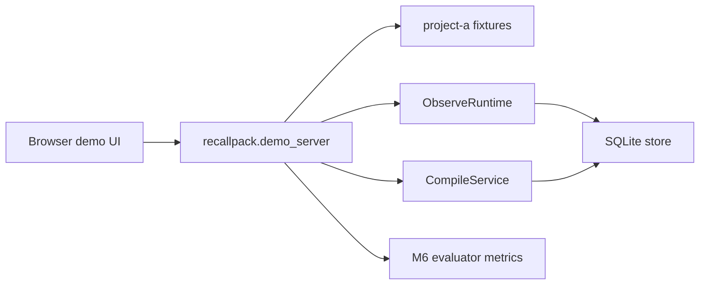

# Alibaba Cloud Deployment Proof

RecallPack M18 has a concrete backend deployment target and a verified local
Docker runtime proof without creating live cloud resources in this repo.

## Target

- Platform: Alibaba Cloud ECS.
- Runtime: one Docker container running `recallpack.demo_server`.
- API surface:
  - `GET /api/demo`
  - `POST /observe`
  - `POST /compile`
- UI surface:
  - `GET /`
  - static files under `web/`
- Persistence target: SQLite at `/data/recallpack.sqlite3`.
- Demo source: local fixtures under `/app/fixtures`.

## Fixed Runtime Limits

```text
deployment_replicas = 1
application_workers = 1
```

The public runtime uses Python stdlib `ThreadingHTTPServer` to prevent a
single slow request from blocking the demo endpoint. It is still a single
container and single Python process; any future ECS scale-out must replace the
application lock boundary with database-backed cross-process locking before
deployment.

## Container Proof

Docker proof status: passed in M104 from the latest sanitized bundle.

Build context: sanitized public bundle.

Latest Docker-proven bundle:
`dist/recallpack-submission-20260704-123846/`.

Image: recallpack-demo:m104-20260704-123846.

Container binding: 127.0.0.1:8817->8789.

```bash
PYTHONPATH=src python3 tools/build_submission_bundle.py \
  --target dist/recallpack-submission-20260704-123846
docker buildx build --platform linux/amd64 --load \
  -f dist/recallpack-submission-20260704-123846/deploy/alibaba-cloud/Dockerfile \
  -t recallpack-demo:m104-20260704-123846 \
  dist/recallpack-submission-20260704-123846
docker run --rm --name recallpack-m102-local \
  -p 127.0.0.1:8817:8789 \
  --tmpfs /data:rw,size=16m \
  recallpack-demo:m104-20260704-123846
```

Docker daemon blocker resolved by starting Docker Desktop.

M104 local build note: the verified image was built locally for `linux/amd64`
from the sanitized bundle Dockerfile and loaded to ECS over SSH. No registry
image push was used.

Verified local checks after starting the container:

```bash
curl http://127.0.0.1:8817/
curl http://127.0.0.1:8817/api/demo
curl -X POST http://127.0.0.1:8817/observe \
  -H 'content-type: application/json' \
  -d '{"project_id":"project-a","session_id":"session-a","event_id":"turn-001","sequence_no":1,"actor":"user","kind":"message","observed_at":"2026-06-24T00:00:00Z","text":"Use three attempts with a fixed 100 ms delay in the retry helper."}'
curl -X POST http://127.0.0.1:8817/compile \
  -H 'content-type: application/json' \
  -d '{"project_id":"project-a","goal":"Update the retry helper to the current project policy.","component":"retry","budget_tokens":512}'
```

Observed evidence:

- `GET /` returned HTTP 200 and the static RecallPack shell.
- `GET /api/demo -> live_contract_passed`.
- `GET /api/demo` returned baseline 1/3 and RecallPack 3/3.
- `GET /api/demo` returned the five curated lifecycle fixtures with
  project-a, project-b, project-c, and project-d.
- `POST /observe -> writes memory through the HTTP observe path`.
- `POST /compile -> includes session-a:turn-005`.
- `POST /compile -> includes session-a:turn-003`.
- `POST /compile -> excludes stale session-a:turn-001`.
- `/compile` reported `retrieval_mode = embedding_top_n` and
  `embedding_top_n_count = 2`.
- `/compile` reported `local_provider_mode = deterministic_keyword_fake`, so
  the credential-free runtime is not zero-vector or identity-rerank smoke.

These commands are proof commands only. Do not run a public ECS instance,
allocate a public IP, configure a domain, push an image, or submit the project
without explicit user approval.

## Approved Public ECS Deployment

Status: passed on 2026-06-26 after explicit user approval and user-created ECS
instance.

Public demo URL:

```text
http://101.133.224.223/
```

Runtime:

- Alibaba Cloud ECS, cn-shanghai.
- Ubuntu 24.04, 2 vCPU, 2 GiB.
- Docker `29.1.3`.
- One container: `recallpack-cloud`.
- Binding: `0.0.0.0:80->8789/tcp`.
- Persistence: Docker volume `recallpack-data` mounted at `/data`.
- Application workers: one Python stdlib `ThreadingHTTPServer` process.

Build source:

```text
M104 local Docker image built from the sanitized public bundle Dockerfile.
The image was loaded to the ECS host over SSH as `ecs-user` with `sudo docker
load` and was not pushed to a registry.
```

Latest redeploy:

- Date: 2026-07-04.
- Source: M104 local Docker image built from
  `dist/recallpack-submission-20260704-123846/`.
- Image tags: `recallpack-demo:m104-20260704-123846` and
  `recallpack-demo:cloud`.
- Container: `recallpack-cloud`.
- SSH user: `ecs-user`; Docker operations use `sudo`.
- Public judge smoke: passed with
  `PYTHONPATH=src python3 tools/judge_smoke.py --url http://101.133.224.223 --timeout 20`.
- M104 redeployed the latest sanitized bundle after public repo verification and
  fresh-clone smoke. The public endpoint now reports five curated fixtures and
  `fresh_m98_live_rerun_status=live_e2e_failed`, matching the current local
  evidence boundary.

Deployment note: ECS could not pull `python:3.12-slim` directly from Docker
Hub due to a registry timeout. The same official `python:3.12-slim` amd64 base
image was pulled locally, verified as `linux/amd64`, loaded into ECS Docker over
SSH, and then the checked-in Dockerfile was built unchanged.

Verified public checks:

```bash
curl -I http://101.133.224.223/
curl http://101.133.224.223/api/demo
python3 tools/judge_smoke.py --url http://101.133.224.223
curl -X POST http://101.133.224.223/compile \
  -H 'content-type: application/json' \
  -d '{"project_id":"project-a","goal":"Update the retry helper to the current project policy.","component":"retry","budget_tokens":512}'
```

Observed public evidence:

- `GET /` returned HTTP 200.
- `GET /api/demo` returned standalone `live_contract_passed` and
  `live_qwen_e2e_status=live_e2e_passed`.
- `tools/judge_smoke.py --url http://101.133.224.223` returned
  `status=passed`.
- Public `POST /compile` returned `status_code=200`.
- Public `POST /compile` selected `session-a:turn-005` and
  `session-a:turn-003`.
- Public `POST /compile` returned `fixture_replayed=false`.
- Public `POST /compile` returned `retrieval_mode=embedding_top_n` and
  `local_provider_mode=deterministic_keyword_fake`.

## Architecture



## Demo Script

1. Open the local demo UI.
2. Learn view: show the ordered 12-event handoff and lifecycle state.
3. Recall view: compare raw full-history reference, keyword-scored fake-embedding
   + rerank RAG baseline, and RecallPack under the 512-token pack.
4. Evaluate view: show the 32-event behavior-contract fixture suite, raw counts before rates,
   supersession edge counts, and stale-selected count.
5. Deployment proof: show the Dockerfile target and the fixed single-worker ECS
   boundary.

## Non-Actions

- No Qwen credentials are required by the deployed demo.
- No live Qwen calls are made by the Docker runtime; it reads the sanitized
  live trace bundled under `docs/submission/`.
- No image is pushed.
- No domain is configured.
- No hackathon submission is performed by this deployment proof.
