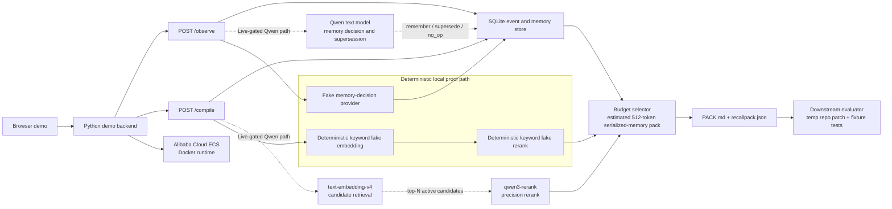

# RecallPack Architecture Diagram

Status: M51 final architecture diagram complete for local review and Devpost
copying. M65 adds a sanitized passing live Qwen E2E trace; M98 adds a fresh
failed rerun where lifecycle filtering held but the downstream delta did not
reproduce.

## Judge-Facing View

## What Is Live, Gated, And Deterministic

Live-gated Qwen path:

- Qwen text model judges memory operations for `POST /observe`.
- `text-embedding-v4` retrieves active memory candidates for `POST /compile`.
- `qwen3-rerank` reranks embedding top-N candidates before budget selection.
- A standalone live provider contract trace passed and is checked in as
  sanitized evidence.
- One stored live Qwen provider-path trace records `live_e2e_passed` for the
  intended observe, compile, and downstream patch-generation path; it is
  integration evidence, not statistical validation.
- The fresh M98 live rerun is stored as `live_e2e_failed`; it supports the
  lifecycle filtering claim but not a fresh passing downstream headline.

Deterministic local proof path:

- The public local demo uses fake providers through the same trace schema.
- The local HTTP `/compile` path uses deterministic keyword fake embedding and
  rerank providers, not zero-vector or identity-rerank smoke.
- Fixture-test downstream proof runs on temporary repo copies.
- Judge smoke verifies `GET /`, `GET /api/demo`, `POST /observe`, and
  `POST /compile` without credentials.

Deployment boundary:

- The public Alibaba Cloud ECS deployment runs the Dockerized stdlib backend.
- The current public ECS runtime is proof that the backend can run remotely,
  not proof that live Qwen E2E passed.
- Public repo creation, live Qwen rerun, image push, and Devpost submission
  remain gated actions.

## One-Line Architecture Summary

Browser demo -> Python demo backend -> SQLite event and memory store, with a
live-gated Qwen path for memory decision, text-embedding-v4 retrieval, and
qwen3-rerank precision ranking, plus a deterministic local proof path for
credential-free judging.

Qwen text model -> text-embedding-v4 -> qwen3-rerank supplies the intended model
work; ordered storage, lifecycle resolution, budget selection, pack assembly,
and downstream evaluation remain deterministic application code.
